# Guide: Pizza Shack - The Pizza Delivery Service

## Prerequisites
Before you start, ensure you have the following:
 - Asgardeo account
 - Node.js v18+ and npm
 - A favorite text editor or IDE

## Deploying the Service
 - Navigate to the <Project_Home>/b2c/tutorial-app/pizza-shack
 - Run following commands

    ```
    npm install
    npm run dev
    ```
 ## Registering the service in Asgardeo

If you have not already done so, create an organization in Asgardeo before registering an application.

 - Sign up for an [Asgardeo account](https://wso2.com/asgardeo/docs/get-started/create-asgardeo-account/).
 - Sign into Asgardeo console and navigate to **Applications > New Application**. 
 - Select Single Page Application.

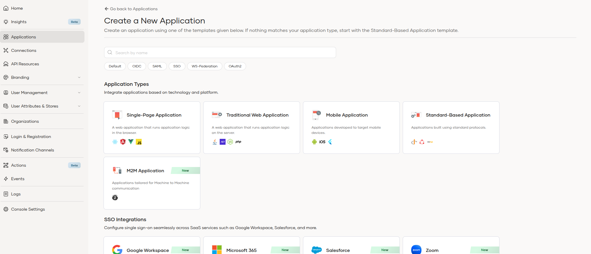

 - Provide name as pizza-shack.
 - Add the following as the authorized redirect URL.

   ```
   http://localhost:5173
   
   ```
 - Click on the **Create** button.
 - Documentation : https://wso2.com/asgardeo/docs/guides/applications/register-single-page-app/

## Configure the login flow

1. Add Basic Authentication.

 - Navigate to the created application. 
 - Click on the **Edit** button. 
 - Navigate to the Login Flow tab. 
 - Switch to Visual Editor. 
 - You can see Basic Authenticator is added as the first step in the login flow.

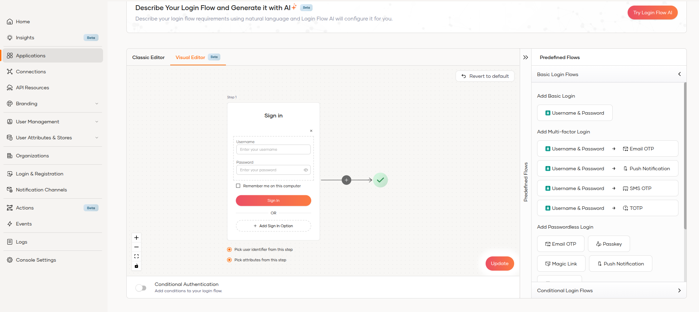

2. Add Google Login

 - Create a Google Connection
   - Register Asgardeo as an OAuth2.0 application on Google.
   - Navigate to **Connections > New connection > Google**
   - Click on the **Create** button.
   - Provide the Client ID and Client Secret and Click on the Create button.
   - Documentation : https://wso2.com/asgardeo/docs/guides/authentication/social-login/add-google-login/#register-the-google-idp

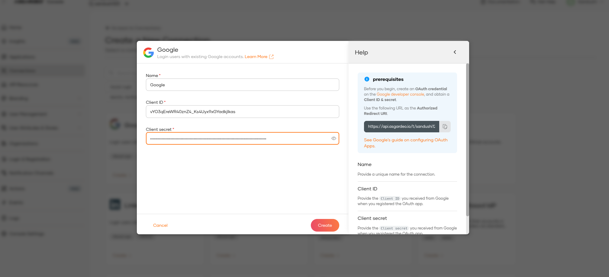

 - Add Google Login
   - Click on the Add Sign In option button.
   - Select Google from the list and Click on **Add** button.
   - Documentation : https://wso2.com/asgardeo/docs/guides/authentication/social-login/add-google-login/

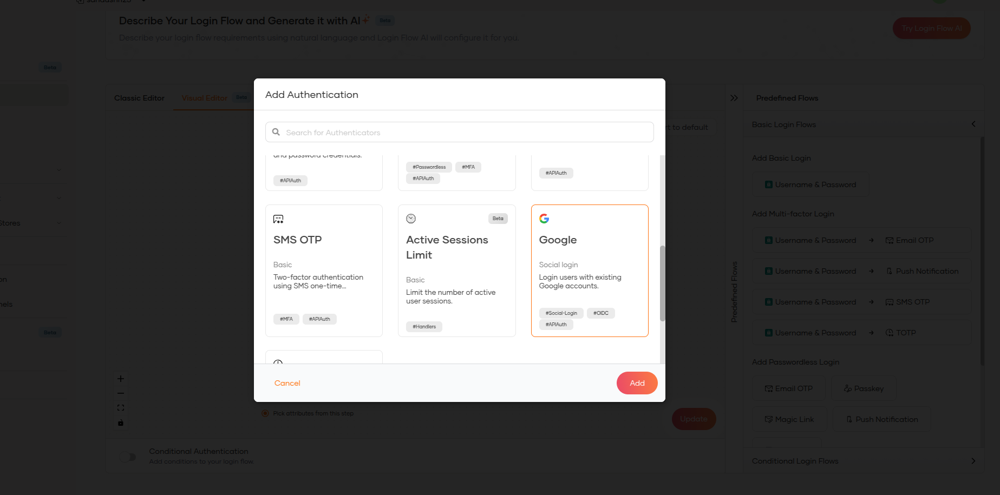

3. Add TOTP As Second Factor

 - Click on + button in the Visual Editor and then step 2 is added. 
 - Click on the **Add Sign In option** button. 
 - Select TOTP and  Click on **Add** button. 
 - Documentation : https://wso2.com/asgardeo/docs/guides/authentication/mfa/add-totp-login/

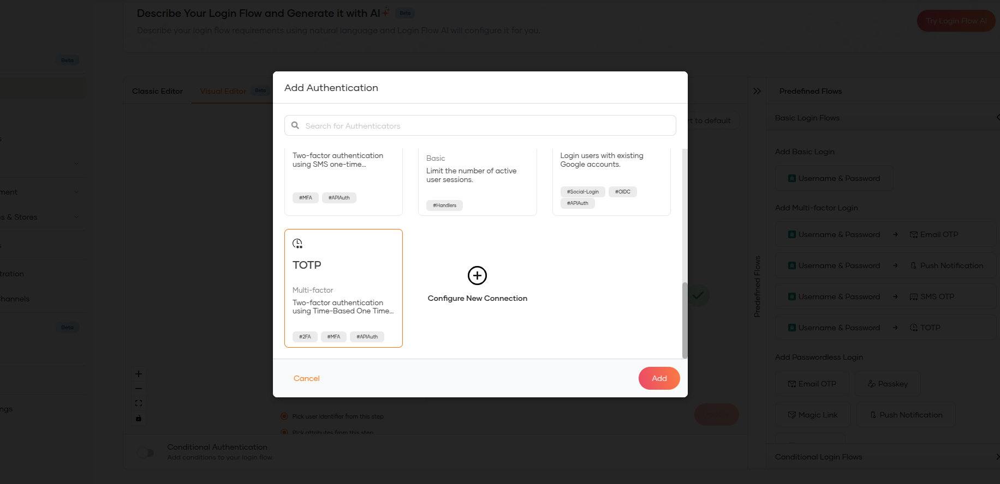

4. Configure passwordless with passkey

 - Click on the **Add Sign In option** button in the second step.
 - Select Passkey from the list and Click on **Add** button.
 - Documentation : https://wso2.com/asgardeo/docs/guides/authentication/passwordless-login/add-passwordless-login-with-passkey/

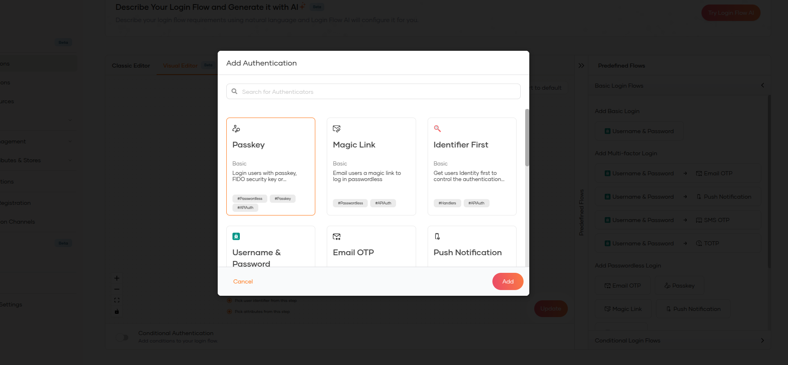

The Login flow is now configured with above three steps as below.


## Enable user self registration

 - Navigate to **Login & Registration > Self Registration** under User Onboarding. 
 - Click on the toggle button to enable Self Registration.
 - Optional :
   - Enable Account verification : To send an email to the user's specified email address requesting account confirmation. 
   - Enable send sign up confirmation email: To send an email to the user's specified email address for a successful registration.
 - Documentation : https://wso2.com/asgardeo/docs/guides/account-configurations/user-onboarding/self-registration/

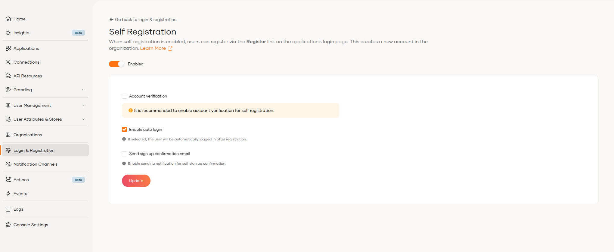

## Enable alternate login identifier
 
 - Navigate to **Login & Registration > Alternative Login Identifiers** under Login Identifier. 
 - Select the Attribute from Mobile/Email which needs to be used as an alternative login identifier.
     - By default the Email attribute is already checked and disabled if you have enabled the Email username type. 
 - Documentation : https://wso2.com/asgardeo/docs/guides/account-configurations/account-login/configure-login-identifiers/

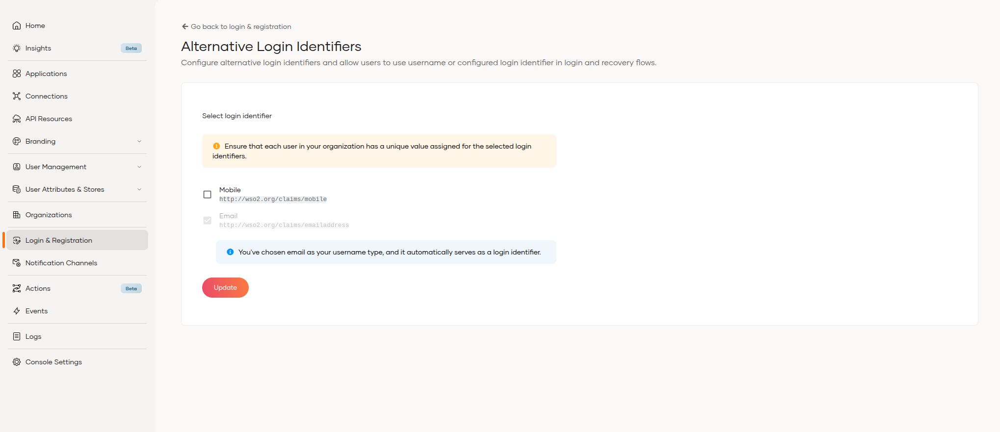

## Enable the new registration composer

 - Navigate to Home. 
 - Click on Enable and Tryout button of Design seamless self-registration experiences. 
 - Click on the toggle button in the popup modal to enable New Self-Registration.

   Or

 - Click on the Profile button on the top Nav bar. 
 - Click on the Feature Review in the dropdown menu. 
 - Click on the toggle button in the popup modal to enable New Self-Registration.

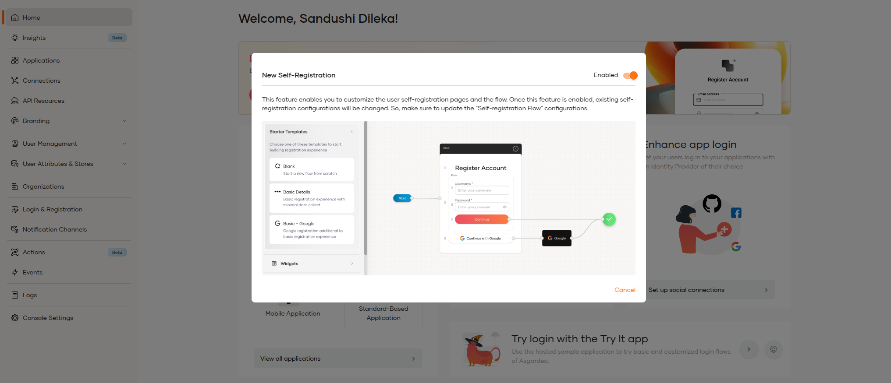

 - After enable, Navigate to Login & Registration > Registration Flow under User onboarding.

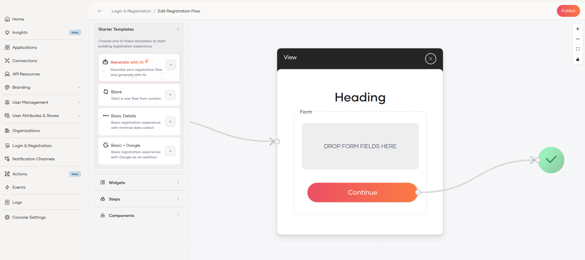

## SCIM API Docs
 
 - Documentation : https://wso2.com/asgardeo/docs/apis/scim2/

## Connecting with existing user stores

 - Navigate to **User Attributes & Stores > User Stores** 
 - Create a Classic Userstore. 
   - **Important**: By default, Asgardeo will create an “Optimized User Store Connection” Make sure to select “Classic User Store Connection”.
   
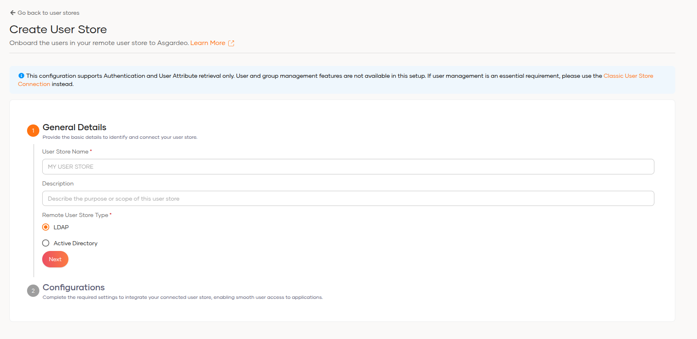

 - Configure the User Store by providing General and Configuration details and click on **Finish** button.

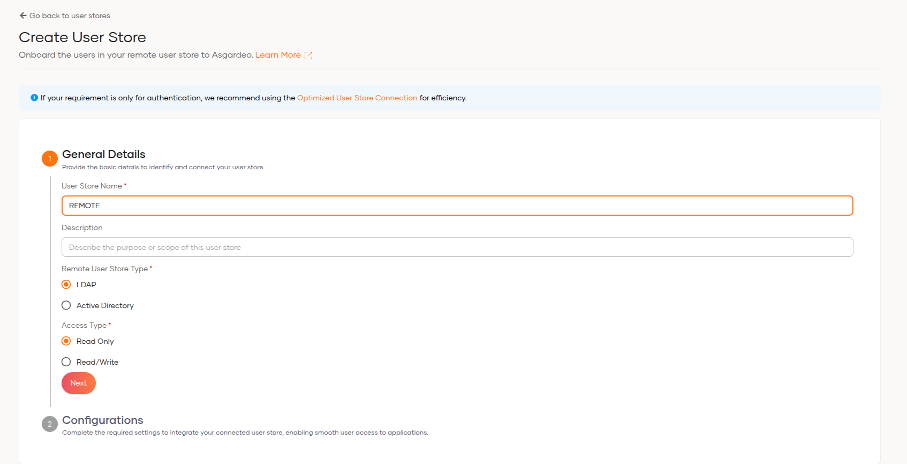

 - Follow the setup guide to generate a token and download, configure and run the agent.

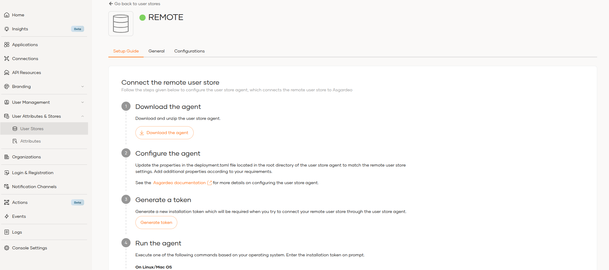

 - Documentation : https://wso2.com/asgardeo/docs/guides/users/user-stores/update-user-stores/

## Login page branding 

 - Navigate **Branding > Styles & Text**. 
 - Select either Organization for organization-wide branding or application and choose an application for application-specific branding. 
 - Update the UI branding options in the General, Design, Advanced, and Text tabs. 
 - Select the different pages from the dropdown in the Preview section to see how the branding affects each page. 
 - Click on **Save & Publish** button. 
 - Documentation : https://wso2.com/asgardeo/docs/guides/branding/configure-ui-branding/

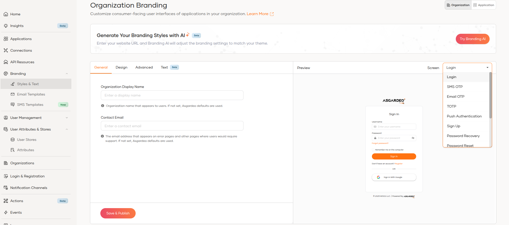

## AI branding

 - Navigate **Branding > Styles & Text**. 
 - Click the **Try Branding AI** button in the topmost banner. 
 - Enter the website URL (a publicly accessible one) and press Enter. 
 - The system will then process the website and start generating the branding theme. 
 - Review and Customize the generated branding if needed. 
 - Documentation : https://wso2.com/asgardeo/docs/guides/branding/branding-ai/

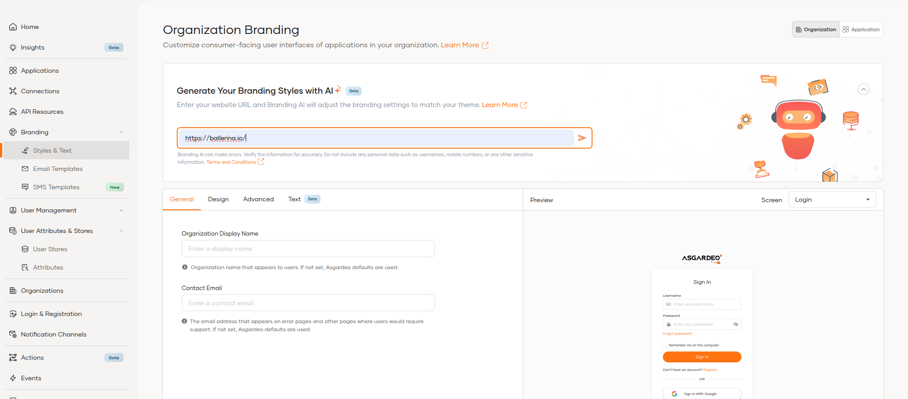

## Configure Onfido

 - Prerequisite: An active administrative account on Onfido 
 - Navigate to **Connections > New connection > Onfido** 
 - Click on the **Create** button.
 - Provide the Name, API Token, Workflow ID and Base URL. 
   - API token and Workflow ID are obtained from the Onfido Dashboard. 
 - Click on the **Create** button.
 - Documentation : https://wso2.com/asgardeo/docs/guides/identity-verification/add-identity-verification-with-onfido/

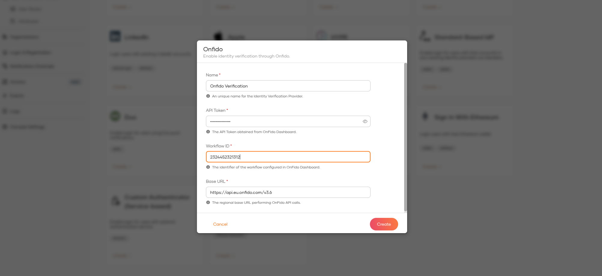

## Configure Custom Authenticator

 - Prerequisite : An external web service to integrate as a custom authenticator. 
 - Navigate to **Connections > New connection > Custom Authenticator (Service-based)**
 - Click on the **Create** button. 
 - Select the Authentication type. 
   - External (Federated) User Authentication 
   - Internal User Authentication 
   - 2FA Authentication
 - Provide Identifier and Display Name. 
 - Enter the Endpoint url and the Authentication Scheme.
   - Endpoint: URL of the web service endpoint you created.
   - Authentication: The authentication method required to invoke your endpoint and configure its properties accordingly.
 - Click on **Finish** Button.
 - Add the custom authenticator in the login flow of an application.
 - Documentation : https://wso2.com/asgardeo/docs/guides/service-extensions/in-flow-extensions/custom-authentication/

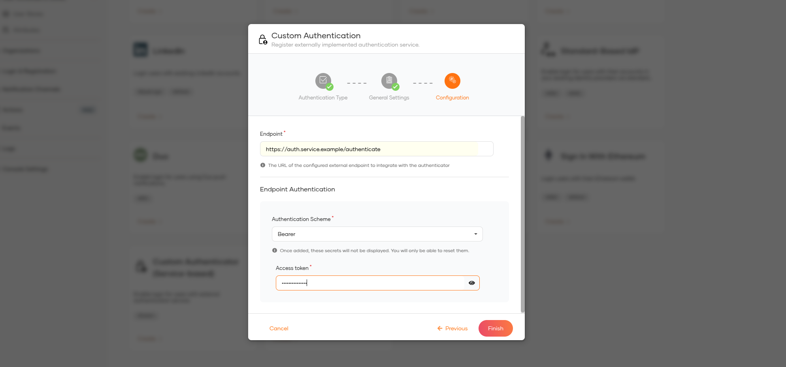


